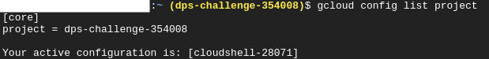
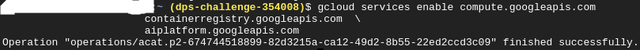

# dps-vertex-ai
This project relies on [this tutorial](https://codelabs.developers.google.com/codelabs/vertex-ai-custom-models#0).\
## 1. Setup your environment:
* navigate to [Cloud Console](http://console.cloud.google.com/)
* create new project with the name **dps-challenge**

* go to [Cloud Shell](https://cloud.google.com/cloud-shell/)
* verify that your project is recognised:
```bash
$ gcloud config list project
```

* Enable APIs:
```bash
$ gcloud services enable compute.googleapis.com \
                       containerregistry.googleapis.com  \
                       aiplatform.googleapis.com
```

* Create a Cloud Storage Bucket
```bash
$ BUCKET_NAME=gs://$GOOGLE_CLOUD_PROJECT-bucket
gsutil mb -l us-central1 $BUCKET_NAME
```