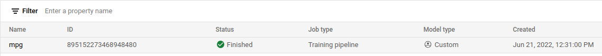

# dps-vertex-ai
This project relies on [this tutorial](https://codelabs.developers.google.com/codelabs/vertex-ai-custom-models#0).\
## 1. Setup your environment:
* navigate to [Cloud Console](http://console.cloud.google.com/)
* create new project with the name **dps-challenge**

* go to [Cloud Shell](https://cloud.google.com/cloud-shell/)
* verify that your project is recognised:
    ```bash
    $ gcloud config list project
    ```
    
* Enable APIs:
    ```bash
    $ gcloud services enable compute.googleapis.com \
                        containerregistry.googleapis.com  \
                        aiplatform.googleapis.com
    ```
    
* Create a Cloud Storage Bucket
    ```bash
    $ BUCKET_NAME=gs://$GOOGLE_CLOUD_PROJECT-bucket
    gsutil mb -l us-central1 $BUCKET_NAME
    ```
## 2. Containerize training code:
* Set up files
    ```bash
    mkdir mpg
    cd mpg
    touch Dockerfile
    mkdir trainer
    touch trainer/train.py
    ```
* [Dockerfile](Dockerfile): It uses a deep learning docker image that contains all the python packages we need. It also sets up our training entrypoint which is the `train.py` script
* [Model training code](trainer/train.py) \
    replace `BUCKET` variable in `train.py` with the value of the global variable `$BUCKT_NAME`
* Build and test the container locally
    ```bash
    $ IMAGE_URI="gcr.io/$GOOGLE_CLOUD_PROJECT/mpg:v1" # define GCR URI
    $ docker build ./ -t $IMAGE_URI # build
    $ docker push $IMAGE_URI # push
    ```
## 3. Run a training job on Vertex AI
* Go to [Cloud Console](http://console.cloud.google.com/)
* Select Vertex AI section from the Navigation menu on the upperleft corner of the webpage
* Navigate to **Training** --> Create:
    1. `Training Method`: **Dataset**, select **No managed dataset** --> **Continue**
    2. `Model details`: Enter whatever you like as **Name**--> **Continue**
    3. `Training container`: select **Custom container** --> in **Custom container settings** select your **Container image** --> **Continue**
    4. `Hyperparameter`: **Continue**
    5. `Compute and pricing`: select **Machine type** --> **Continue**
    6. `Prediction container`: **Start Training**

    After training is done, you will see an output similar to this:
    

## 4. Deploy a model endpoint
* Install Vertex SDK: 
    ```bash
    pip3 install google-cloud-aiplatform --upgrade --user
    ```
* Create model and deploy endpoint: code of deployment is in `deploy.py`
    run the next command inside the directory `mpg`
    ```bash
    python3 deploy.py | tee deploy-output.txt
    ```
    when the endpoint deployment is completed, navigate to [Model](https://console.cloud.google.com/ai/platform/models) so you can see the model was deployed successfully: \
    
* Get predictions:
    * change the input `test_mpg` inside the script `predict.py`
    * change the `ENDPOINT_STRING` inside `predict.py` using the commands:
    ```bash
    $ ENDPOINT=$(cat deploy-output.txt | sed -nre 's:.*Resource name\: (.*):\1:p' | tail -1)
    $ sed -i "s|ENDPOINT_STRING|$ENDPOINT|g" predict.py
    ```
    * ```
      python3 predict.py
      ```
